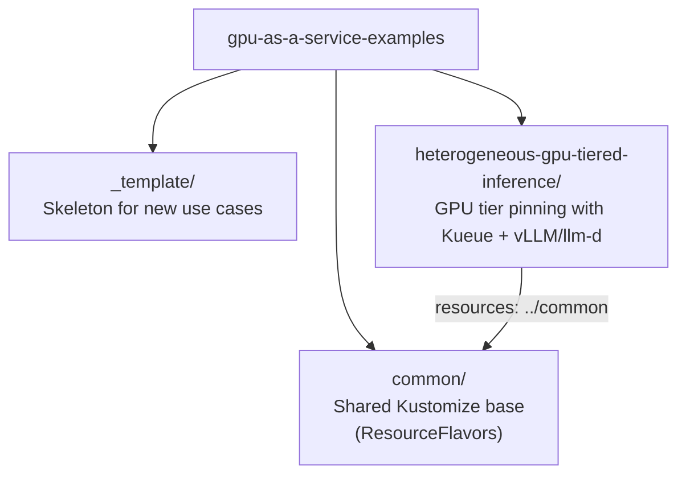
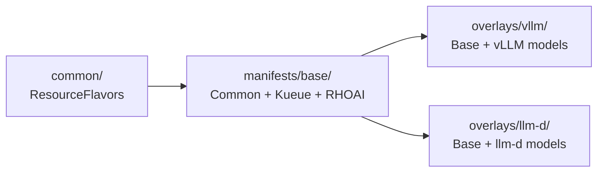

# GPU as a Service — Examples

Reference implementations for **GPU-as-a-Service patterns on Red Hat OpenShift AI**. This repository provides production-ready Kustomize manifests, architecture diagrams, and step-by-step guides for deploying and managing GPU workloads at scale on OpenShift AI.

## Why This Repo Exists

Organizations running mixed-GPU OpenShift AI clusters face common challenges:

- **GPU tier pinning** — Ensuring models land on the right GPU type (A100 vs H100 vs H200) without manual node selection
- **Quota and fair sharing** — Controlling how many GPUs each team can consume per tier
- **Intelligent inference routing** — Directing requests to the replica with the best cache hit rate or shortest queue
- **Tensor parallelism** — Splitting large models across multiple GPUs on the correct hardware class

Each use case in this repo solves one or more of these challenges with declarative Kustomize manifests that can be reviewed, customized, and applied in a single command.

---

## Repository Layout



```
gpu-as-a-service-examples/
  README.md                              # This file
  CONTRIBUTING.md                        # How to add a new use case
  LICENSE                                # Apache-2.0
  common/                               # Shared Kustomize base (all use cases depend on this)
    kustomization.yaml
    kueue/
      resource-flavors.yaml              # GPU tier definitions (A100, H100, H200)
  _template/                             # Copy this to start a new use case
    README.md
    manifests/base/kustomization.yaml
  heterogeneous-gpu-tiered-inference/    # First use case
    README.md
    manifests/
      base/kustomization.yaml           # Kustomize base (common + kueue + rhoai)
      overlays/vllm/kustomization.yaml  # Add vLLM InferenceServices
      overlays/llm-d/kustomization.yaml # Add llm-d LLMInferenceServices
      kueue/                            # ClusterQueues, LocalQueues
      rhoai/                            # HardwareProfiles
      vllm/                             # vLLM InferenceService manifests
      llm-d/                            # llm-d LLMInferenceService manifests
```

---

## Use Cases

| Use Case | What It Does | Key Technologies | Difficulty |
|----------|-------------|------------------|------------|
| [Heterogeneous GPU Tiered Inference](heterogeneous-gpu-tiered-inference/) | Pin models to specific GPU tiers (A100/H100/H200) in a mixed-GPU cluster, with optional intelligent request routing | Kueue ResourceFlavors, Hardware Profiles, vLLM tensor parallelism, llm-d EPP | Intermediate |

Each use case includes:
- **README.md** — Problem statement, architecture diagrams, step-by-step implementation guide with inline YAML, verification commands, and known gaps
- **manifests/** — All Kubernetes/OpenShift YAML organized with Kustomize bases and overlays

---

## Shared Prerequisites

Every use case in this repo requires the following platform components. Individual use cases may have additional requirements listed in their own `README.md`.

| Component | Version | Purpose |
|-----------|---------|---------|
| OpenShift Container Platform | **4.19.9+** | Kubernetes distribution with GPU support |
| Red Hat OpenShift AI | **3.4+** | AI/ML platform — model serving, dashboard, HardwareProfiles |
| Red Hat Build of Kueue (RHBoK) | latest | Workload scheduling, GPU quotas, and fair sharing |
| NVIDIA GPU Operator | latest | Exposes GPU devices to the Kubernetes scheduler |
| Node Feature Discovery (NFD) | latest | Auto-labels nodes by GPU product (e.g., `nvidia.com/gpu.product: A100-SXM4-80GB` or `A100-80GB-PCIe`) |

### Verify Your Cluster

Confirm GPU nodes are labeled before applying any use case:

```bash
oc get nodes -l nvidia.com/gpu.product -o custom-columns=\
  NODE:.metadata.name,\
  GPU:.metadata.labels.nvidia\.com/gpu\.product,\
  COUNT:.status.capacity.nvidia\.com/gpu
```

---

## Shared Resources (`common/`)

The [`common/`](common/) directory is a Kustomize base containing cluster-scoped resources reused by all use cases. Currently it includes:

| Resource | File | Description |
|----------|------|-------------|
| `ResourceFlavor` | `common/kueue/resource-flavors.yaml` | Maps GPU tiers (A100, H100, H200) to NFD node labels |

Each use case pulls in `common/` automatically via its `kustomization.yaml`:

```yaml
resources:
  - ../../../common       # shared ResourceFlavors
  - ../kueue              # use-case-specific ClusterQueues
```

**Customization:** The `nvidia.com/gpu.product` label value is **SKU-specific** — PCIe and SXM variants of the same GPU produce different labels (e.g., `A100-SXM4-80GB` vs `A100-80GB-PCIe`). Update the values in `common/kueue/resource-flavors.yaml` to match the actual NFD labels on your cluster. Run `oc get nodes -o jsonpath='{.items[*].metadata.labels.nvidia\.com/gpu\.product}'` to find your label values.

---

## Getting Started

### 1. Clone the repo

```bash
git clone https://github.com/rrbanda/gpu-as-a-service-examples.git
cd gpu-as-a-service-examples
```

### 2. Pick a use case

Browse the [Use Cases](#use-cases) table and `cd` into the directory.

### 3. Customize for your cluster

Each use case README has a **Customization** table listing the values you need to change (GPU labels, quotas, namespaces, model storage). Edit the YAML files directly.

### 4. Preview and apply

```bash
# Preview what Kustomize will generate (no changes applied)
oc apply -k heterogeneous-gpu-tiered-inference/manifests/overlays/vllm/ --dry-run=server

# Apply everything
oc apply -k heterogeneous-gpu-tiered-inference/manifests/overlays/vllm/
```

### 5. Verify

Follow the **Verification** section in the use case's `README.md` for `oc get` commands and `curl` tests.

---

## How Kustomize Is Organized

Each use case follows a layered Kustomize structure:



| Layer | Path | What It Contains | Apply Command |
|-------|------|-----------------|---------------|
| **Shared base** | `common/` | ResourceFlavors (GPU tier definitions) | `oc apply -k common/` |
| **Use-case base** | `manifests/base/` | Shared + ClusterQueues + LocalQueues + HardwareProfiles | `oc apply -k manifests/base/` |
| **vLLM overlay** | `manifests/overlays/vllm/` | Base + vLLM InferenceService manifests | `oc apply -k manifests/overlays/vllm/` |
| **llm-d overlay** | `manifests/overlays/llm-d/` | Base + llm-d LLMInferenceService manifests | `oc apply -k manifests/overlays/llm-d/` |

Pick the overlay that matches your deployment model. Each overlay includes everything below it, so a single `oc apply -k` is all you need.

---

## Per-Use-Case Layout

Every use case follows this consistent structure:

```
<use-case>/
  README.md                # Full guide: problem statement, architecture, step-by-step, verification
  manifests/
    base/
      kustomization.yaml   # Kustomize base (includes ../common + core manifests)
    overlays/              # Deployment variants
      <variant>/
        kustomization.yaml
    <component>/           # Grouped manifests with per-component kustomization.yaml
      kustomization.yaml
      <resource>.yaml
```

---

## Adding a New Use Case

1. Copy the skeleton: `cp -r _template/ my-new-use-case/`
2. Add your manifests under `manifests/`, organized by component.
3. Add a `kustomization.yaml` in each component directory listing its resources.
4. Create `manifests/base/kustomization.yaml` composing `../../../common` + your components.
5. Add overlays under `manifests/overlays/` if you have deployment variants.
6. Fill in `README.md` (problem statement, architecture, prerequisites, quick start, step-by-step guide with inline YAML, verification, and known gaps).
7. Add a row to the [Use Cases](#use-cases) table in this README.

See [CONTRIBUTING.md](CONTRIBUTING.md) for the full checklist and naming conventions.

---

## References

- [Red Hat OpenShift AI 3.4 — Managing Workloads with Kueue](https://docs.redhat.com/en/documentation/red_hat_openshift_ai_self-managed/3.4/html/managing_openshift_ai/managing-workloads-with-kueue)
- [Red Hat OpenShift AI 3.4 — Distributed Inference with llm-d](https://docs.redhat.com/en/documentation/red_hat_openshift_ai_self-managed/3.4/html/deploy_models_using_distributed_inference_with_llm-d/index)
- [Red Hat OpenShift AI 3.4 — Configuring Model Serving](https://docs.redhat.com/en/documentation/red_hat_openshift_ai_self-managed/3.4/html/configuring_your_model-serving_platform)
- [Kueue Upstream Documentation](https://kueue.sigs.k8s.io/)
- [Kustomize Documentation](https://kubectl.docs.kubernetes.io/references/kustomize/)

## License

Apache-2.0
