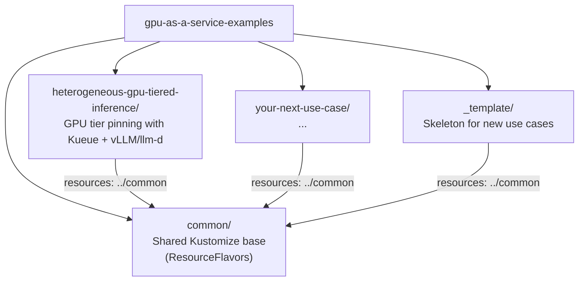

# GPU as a Service — Examples

Reference implementations for GPU-as-a-Service patterns on Red Hat OpenShift AI. Each directory is a self-contained use case with Kustomize manifests and a step-by-step guide.

## Repository Layout



## Use Cases

| Use Case | Description | Difficulty | Platform |
|----------|-------------|------------|----------|
| [Heterogeneous GPU Tiered Inference](heterogeneous-gpu-tiered-inference/) | Pin models to GPU tiers (A100/H100/H200) in a mixed-GPU cluster using Kueue ResourceFlavors, Hardware Profiles, vLLM tensor parallelism, and llm-d intelligent routing | Intermediate | RHOAI 3.4, RHBoK, vLLM, llm-d |

## Shared Prerequisites

All use cases require these platform components:

| Component | Version | Purpose |
|-----------|---------|---------|
| OpenShift Container Platform | **4.19.9+** | Kubernetes distribution |
| Red Hat OpenShift AI | **3.4+** | AI/ML platform (model serving, dashboard) |
| Red Hat Build of Kueue | latest | GPU workload scheduling and quotas |
| NVIDIA GPU Operator + NFD | latest | GPU device exposure and node labeling |

Individual use cases may have additional prerequisites — check each use case's `README.md`.

## Shared Resources

The [`common/`](common/) directory contains cluster-scoped Kustomize resources reused across all use cases:

| Resource | Path | Description |
|----------|------|-------------|
| ResourceFlavors | `common/kueue/resource-flavors.yaml` | GPU tier definitions (A100, H100, H200) mapped to NFD node labels |

Each use case includes these via `resources: [../common]` in its `kustomization.yaml`. See [`common/README.md`](common/README.md) for customization details.

## Getting Started

1. **Pick a use case** from the table above and `cd` into its directory
2. **Read the `README.md`** for use-case-specific prerequisites and an architecture overview
3. **Customize manifests** for your cluster (GPU labels, namespaces, quotas) — see the Customization table in each README
4. **Apply with Kustomize:**

```bash
# Example: deploy the heterogeneous GPU tiered inference use case with vLLM
oc apply -k heterogeneous-gpu-tiered-inference/manifests/overlays/vllm/

# Preview first
oc apply -k heterogeneous-gpu-tiered-inference/manifests/overlays/vllm/ --dry-run=server
```

5. **Follow the `GUIDE.md`** for step-by-step walkthrough, verification commands, and architecture details

## Per-Use-Case Layout

Each use case follows a consistent structure:

```
<use-case>/
  README.md              # Overview, prerequisites, quick start
  GUIDE.md               # Full step-by-step implementation guide
  manifests/             # All Kubernetes/OpenShift YAML manifests
    base/
      kustomization.yaml # Kustomize base (includes ../common + core manifests)
    overlays/            # Deployment variants (optional)
      <variant>/
        kustomization.yaml
    <component>/         # Manifest groups with per-component kustomization.yaml
```

## Adding a New Use Case

1. Copy the `_template/` directory:

```bash
cp -r _template/ my-new-use-case/
```

2. Fill in `README.md`, `GUIDE.md`, and add manifests under `manifests/`
3. Add `kustomization.yaml` files in each manifest subdirectory and in `manifests/base/`
4. Add overlays under `manifests/overlays/` if the use case has deployment variants
5. Add a row to the Use Cases table in this README
6. See [CONTRIBUTING.md](CONTRIBUTING.md) for the full checklist

## License

Apache-2.0
