# Heterogeneous GPU Tiered Inference

Pin each model to the appropriate GPU tier in a mixed-GPU OpenShift cluster (A100 + H100/H200) using Kueue, vLLM, and llm-d on Red Hat OpenShift AI 3.4.

## Problem Statement

An organization with a mixed-GPU cluster (A100 + H100/H200) needs to:
- **GPU-tier matching** -- Pin models to the appropriate GPU type based on workload size. Smaller models on A100s; larger or latency-sensitive models on H100/H200.
- **Intra-cluster placement** -- Route deployment requests to the correct GPU type within the same cluster without manual intervention.
- **Tensor parallelism** -- Support models spanning multiple GPUs (TP), placed on the correct GPU class with the right parallelism config.

## What This Solves

| Requirement | Status | Mechanism |
|-------------|--------|-----------|
| GPU-tier matching | **Supported (GA)** | ResourceFlavor nodeLabels + ClusterQueue admission |
| Intra-cluster placement | **Supported (GA)** | Hardware Profile -> LocalQueue -> ClusterQueue -> ResourceFlavor |
| Tensor parallelism | **Partially Supported** | vLLM `--tensor-parallel-size` works; topology-aware scheduling (TAS) not yet in RHOAI |
| Intelligent request routing | **Supported (GA)** | llm-d EPP with queue-scorer + prefix-cache-scorer |

## Architecture

```mermaid
flowchart LR
    User["User / RHOAI Dashboard"]
    HP["Hardware Profile"]
    LQ["LocalQueue"]
    CQ["ClusterQueue"]
    RF["ResourceFlavor"]
    Node["GPU Node"]
    vLLM["vLLM Pod"]

    User -->|"selects profile"| HP
    HP -->|"sets queue-name"| LQ
    LQ -->|"admits to"| CQ
    CQ -->|"matches flavor"| RF
    RF -->|"nodeLabels"| Node
    Node -->|"schedules"| vLLM
```



## Prerequisites

- OpenShift Container Platform **4.19.9+**
- Red Hat OpenShift AI **3.4+**
- Red Hat Build of Kueue operator
- NVIDIA GPU Operator + Node Feature Discovery
- Mixed GPU nodes labeled by NFD (e.g., `nvidia.com/gpu.product: A100-SXM4-80GB`)
- *(For llm-d)* LeaderWorkerSet Operator + Red Hat Connectivity Link 1.1.1+

## Quick Start

```bash
# Option A: Deploy with vLLM model serving
oc apply -k manifests/overlays/vllm/

# Option B: Deploy with llm-d intelligent routing
oc apply -k manifests/overlays/llm-d/

# Base only (Kueue scheduling + hardware profiles, no models)
oc apply -k manifests/base/
```

Preview before applying:

```bash
oc apply -k manifests/overlays/vllm/ --dry-run=server
```

## File Structure

```
manifests/
  base/
    kustomization.yaml             # Composes common + kueue + rhoai
  overlays/
    vllm/
      kustomization.yaml           # Base + vLLM InferenceServices
    llm-d/
      kustomization.yaml           # Base + llm-d LLMInferenceServices
  kueue/
    kustomization.yaml
    cluster-queues-strict.yaml     # Separate ClusterQueues per tier (strict pinning)
    cluster-queue-fungible.yaml    # Alternative: single queue with flavor fallback
    local-queues.yaml              # Per-namespace LocalQueues
  rhoai/
    kustomization.yaml
    hardware-profiles.yaml         # Dashboard-facing GPU tier selection
  vllm/
    kustomization.yaml
    inferenceservice-8b-a100.yaml    # Qwen3-8B on A100 (1 GPU)
    inferenceservice-70b-h100-tp.yaml  # Llama-3-70B on H100 (TP=4)
  llm-d/
    kustomization.yaml
    llmisvc-8b-a100.yaml           # Qwen3-8B with llm-d routing on A100
    llmisvc-70b-h100-tp.yaml       # Llama-3-70B with llm-d routing on H100 (TP=4)
../common/                         # Shared resources (repo-level)
  kustomization.yaml
  kueue/
    resource-flavors.yaml          # One ResourceFlavor per GPU type (A100, H100, H200)
GUIDE.md                           # Full step-by-step implementation guide
```

## Customization

Before applying, update these values to match your cluster:

| Value | Where | What to Change |
|-------|-------|----------------|
| `nvidia.com/gpu.product` label values | `../common/kueue/resource-flavors.yaml` | Match your actual NFD labels (`oc get nodes -l nvidia.com/gpu.product`) |
| GPU quotas (`nominalQuota`) | `manifests/kueue/cluster-queues-strict.yaml` | Set to your actual GPU counts per tier |
| Namespace names (`team-a`, `team-b`) | `manifests/kueue/local-queues.yaml`, model manifests | Match your team namespaces |
| Model storage (`storage.key`, `storage.path`) | vLLM manifests | Point to your S3/PVC model storage |
| Model URIs (`spec.model.uri`) | llm-d manifests | Point to your HuggingFace or local model |

## Full Guide

See **[GUIDE.md](GUIDE.md)** for the complete step-by-step walkthrough with architecture diagrams, design decisions, verification commands, and known gaps.

## References

- [RHOAI 3.4 — Managing Workloads with Kueue](https://docs.redhat.com/en/documentation/red_hat_openshift_ai_self-managed/3.4/html/managing_openshift_ai/managing-workloads-with-kueue)
- [RHOAI 3.4 — Distributed Inference with llm-d](https://docs.redhat.com/en/documentation/red_hat_openshift_ai_self-managed/3.4/html/deploy_models_using_distributed_inference_with_llm-d/index)
- [RHOAI 3.4 — Configuring Model Serving](https://docs.redhat.com/en/documentation/red_hat_openshift_ai_self-managed/3.4/html/configuring_your_model-serving_platform)
- [Kueue Upstream Documentation](https://kueue.sigs.k8s.io/)
