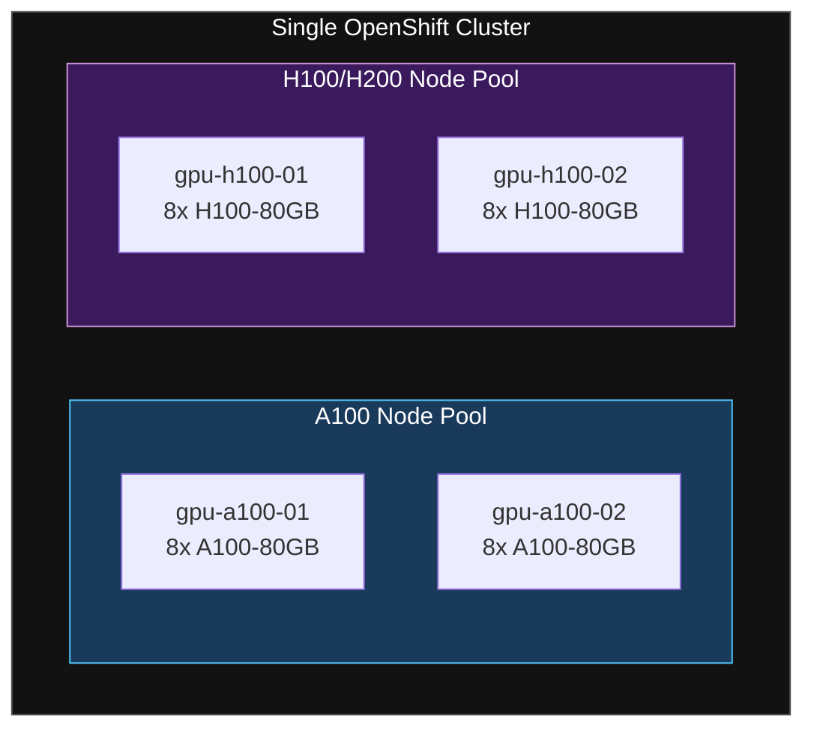
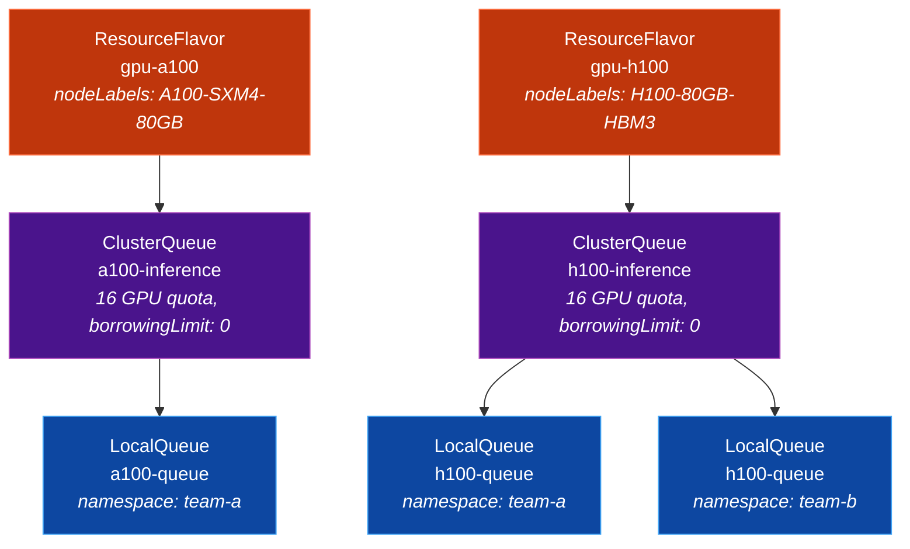
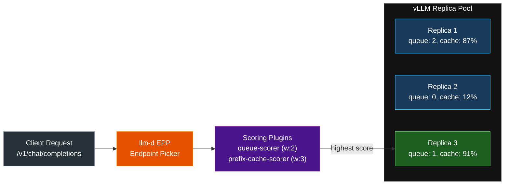
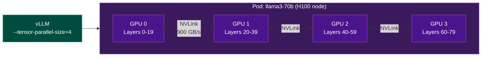

# Heterogeneous GPU Tiered Inference

> **Scenario:** A single OpenShift cluster with mixed NVIDIA accelerators (A100 + H100/H200).
> Pin each model to the appropriate GPU tier, support tensor parallelism for large models, and add intelligent inference routing — all without manual node targeting.
>
> **Platform:** Red Hat OpenShift AI 3.4 · Red Hat Build of Kueue · vLLM · llm-d

## What This Solves

| Requirement | Status | Mechanism |
|-------------|--------|-----------|
| GPU-tier matching | **Supported (GA)** | ResourceFlavor nodeLabels + ClusterQueue admission |
| Intra-cluster placement | **Supported (GA)** | Hardware Profile -> LocalQueue -> ClusterQueue -> ResourceFlavor |
| Tensor parallelism | **Partially Supported** | vLLM `--tensor-parallel-size` works; topology-aware scheduling (TAS) exists in upstream Kueue but is not included in Red Hat Build of Kueue or RHOAI 3.4 |
| Intelligent request routing | **Supported (GA)** | llm-d EPP with queue-scorer + prefix-cache-scorer |

## Quick Start

```bash
# Option A: Deploy with vLLM model serving
oc apply -k manifests/overlays/vllm/

# Option B: Deploy with llm-d intelligent routing
oc apply -k manifests/overlays/llm-d/

# Base only (Kueue scheduling + hardware profiles, no models)
oc apply -k manifests/base/
```

Preview before applying:

```bash
oc apply -k manifests/overlays/vllm/ --dry-run=server
```

## File Structure

```
manifests/
  base/
    kustomization.yaml             # Composes common + kueue + rhoai
  overlays/
    vllm/
      kustomization.yaml           # Base + vLLM InferenceServices
    llm-d/
      kustomization.yaml           # Base + llm-d LLMInferenceServices
  kueue/
    kustomization.yaml
    cluster-queues-strict.yaml     # Separate ClusterQueues per tier (strict pinning)
    cluster-queue-fungible.yaml    # Alternative: single queue with flavor fallback
    local-queues.yaml              # Per-namespace LocalQueues
  rhoai/
    kustomization.yaml
    hardware-profiles.yaml         # Dashboard-facing GPU tier selection
  vllm/
    kustomization.yaml
    inferenceservice-8b-a100.yaml    # Qwen3-8B on A100 (1 GPU)
    inferenceservice-70b-h100-tp.yaml  # Llama-3-70B on H100 (TP=4)
  llm-d/
    kustomization.yaml
    llmisvc-8b-a100.yaml           # Qwen3-8B with llm-d routing on A100
    llmisvc-70b-h100-tp.yaml       # Llama-3-70B with llm-d routing on H100 (TP=4)
../common/                         # Shared resources (repo-level)
  kustomization.yaml
  kueue/
    resource-flavors.yaml          # One ResourceFlavor per GPU type (A100, H100, H200)
```

## Customization

Before applying, update these values to match your cluster:

| Value | Where | What to Change |
|-------|-------|----------------|
| `nvidia.com/gpu.product` label values | `../common/kueue/resource-flavors.yaml` | Match your actual NFD labels (`oc get nodes -l nvidia.com/gpu.product`) |
| GPU quotas (`nominalQuota`) | `manifests/kueue/cluster-queues-strict.yaml` | Set to your actual GPU counts per tier |
| Namespace names (`team-a`, `team-b`) | `manifests/kueue/local-queues.yaml`, model manifests | Match your team namespaces |
| Model storage (`storage.key`, `storage.path`) | vLLM manifests | Point to your S3/PVC model storage |
| Model URIs (`spec.model.uri`) | llm-d manifests | Point to your HuggingFace or local model |

---

## Architecture Overview

### Cluster Layout



### Data Flow: User Request to GPU Placement

```mermaid
flowchart LR
    User["User / RHOAI Dashboard"]
    HP["Hardware Profile<br/>(A100 1GPU or H100 TP=4)"]
    LQ["LocalQueue<br/>(team-a namespace)"]
    CQ["ClusterQueue<br/>(a100-inference or h100-inference)"]
    RF["ResourceFlavor<br/>(gpu-a100 or gpu-h100)"]
    Node["Target Node<br/>(matched by nodeLabels)"]
    vLLM["vLLM Pod<br/>(serves model)"]

    User -->|"selects profile"| HP
    HP -->|"sets queue-name label"| LQ
    LQ -->|"admits to"| CQ
    CQ -->|"matches flavor"| RF
    RF -->|"nodeLabels selector"| Node
    Node -->|"schedules pod"| vLLM

    style User fill:#263238,stroke:#90a4ae,color:#fff
    style HP fill:#1b5e20,stroke:#66bb6a,color:#fff
    style LQ fill:#0d47a1,stroke:#42a5f5,color:#fff
    style CQ fill:#4a148c,stroke:#ab47bc,color:#fff
    style RF fill:#bf360c,stroke:#ff7043,color:#fff
    style Node fill:#1a3a5c,stroke:#4fc3f7,color:#fff
    style vLLM fill:#004d40,stroke:#26a69a,color:#fff
```



### Kueue Object Hierarchy



### llm-d Request Routing (Inference Time)



### Tensor Parallelism: Single Pod, Multiple GPUs



**Data flow summary:**
1. User selects a Hardware Profile in the RHOAI dashboard (or sets `kueue.x-k8s.io/queue-name` in YAML)
2. Kueue's admission controller matches the workload to the correct ResourceFlavor
3. The ResourceFlavor's `nodeLabels` ensure the pod lands on the right GPU tier
4. vLLM serves the model (with tensor parallelism if configured)
5. llm-d's Endpoint Picker routes inference requests to the optimal replica

---

## Step 0 — Prerequisites

Before starting, confirm all platform components are in place.

### Operators Required

| Operator | Namespace | Purpose |
|----------|-----------|---------|
| Red Hat OpenShift AI 3.4+ | `redhat-ods-operator` | Core AI platform |
| Red Hat Build of Kueue | `openshift-kueue-operator` | Workload scheduling and quotas |
| cert-manager Operator | `cert-manager` | Required by Kueue |
| NVIDIA GPU Operator + NFD | `nvidia-gpu-operator` | GPU device exposure, node labeling |
| LeaderWorkerSet Operator | cluster-scoped | Required by llm-d |
| Red Hat Connectivity Link 1.1.1+ | `openshift-operators` | Auth for llm-d inference endpoints |

### OpenShift Version

- OCP **4.19.9** or later (required for llm-d Gateway API support)

### Verify GPU Node Labels

NFD + GPU Operator must have labeled your nodes. Confirm:

```bash
oc get nodes -l nvidia.com/gpu.product -o custom-columns=\
  NODE:.metadata.name,\
  GPU:.metadata.labels.nvidia\.com/gpu\.product,\
  COUNT:.status.capacity.nvidia\.com/gpu
```

Expected output:
```
NODE            GPU                        COUNT
gpu-a100-01     A100-SXM4-80GB             8
gpu-a100-02     A100-SXM4-80GB             8
gpu-h100-01     NVIDIA-H100-80GB-HBM3     8
gpu-h100-02     NVIDIA-H100-80GB-HBM3     8
```

If GPU labels are missing, NFD is not running or the GPU Operator is not installed.

### Activate Kueue in OpenShift AI

Set the Kueue management state to `Unmanaged` so RHOAI integrates with the external RHBoK Operator:

```bash
oc patch datasciencecluster default-dsc \
  --type='merge' \
  -p '{"spec":{"components":{"kueue":{"managementState":"Unmanaged"}}}}' \
  -n redhat-ods-operator
```

Enable Kueue in the dashboard:

```bash
oc patch odhdashboardconfig odh-dashboard-config \
  -n redhat-ods-applications \
  --type merge \
  -p '{"spec":{"dashboardConfig":{"disableKueue":false}}}'
```

Verify Kueue pods are running:

```bash
oc get pods -n openshift-kueue-operator
```

```
kueue-controller-manager-d9fc745df-ph77w    1/1     Running
openshift-kueue-operator-69cfbf45cf-lwtpm   1/1     Running
```

---

## Step 1 — Define ResourceFlavors (One Per GPU Tier)

A ResourceFlavor maps a GPU type to the node labels that identify where those GPUs live. Create one per GPU tier in your cluster.

These are defined in the shared `common/` directory at the repo root (`common/kueue/resource-flavors.yaml`) because they are cluster-scoped and reusable across use cases. The Kustomize base for this use case includes them automatically.

```yaml
# common/kueue/resource-flavors.yaml
---
apiVersion: kueue.x-k8s.io/v1beta2
kind: ResourceFlavor
metadata:
  name: gpu-a100
spec:
  nodeLabels:
    nvidia.com/gpu.product: A100-SXM4-80GB
---
apiVersion: kueue.x-k8s.io/v1beta2
kind: ResourceFlavor
metadata:
  name: gpu-h100
spec:
  nodeLabels:
    nvidia.com/gpu.product: NVIDIA-H100-80GB-HBM3
---
apiVersion: kueue.x-k8s.io/v1beta2
kind: ResourceFlavor
metadata:
  name: gpu-h200
spec:
  nodeLabels:
    nvidia.com/gpu.product: NVIDIA-H200-141GB-HBM3e
```

Apply individually:

```bash
oc apply -f ../common/kueue/resource-flavors.yaml
```

Or as part of the full Kustomize overlay (see [Apply Everything at Once](#apply-everything-at-once) below).

Verify:

```bash
oc get resourceflavors
```

```
NAME       AGE
gpu-a100   5s
gpu-h100   5s
gpu-h200   5s
```

> **Note:** The exact value for `nvidia.com/gpu.product` depends on your GPU Operator version and hardware SKU. Run `oc get nodes -o jsonpath='{.items[*].metadata.labels.nvidia\.com/gpu\.product}'` to find the exact label values on your cluster.

---

## Step 2 — Create ClusterQueue with Per-Tier Quotas

The ClusterQueue defines how many GPUs of each type are available for scheduling, and how workloads are admitted.

### Design Decision: One Queue vs. Separate Queues

| Pattern | When to Use | Behavior |
|---------|-------------|----------|
| **Single ClusterQueue, multiple flavors** | Models are flexible about GPU type; you want Kueue to pick the best available | If gpu-h100 is full, Kueue can admit on gpu-a100 (fungibility) |
| **Separate ClusterQueues per tier** | Strict pinning required; A100 models must never land on H100 and vice versa | No cross-tier fallback; each queue admits only its own flavor |

This guide shows **strict pinning** (separate queues per tier) since the goal is to pin models to specific GPU types. The alternative is shown at the end.

### Pattern A: Strict Tier Pinning (Recommended for This Use Case)

```yaml
# cluster-queues-strict.yaml
---
apiVersion: kueue.x-k8s.io/v1beta2
kind: ClusterQueue
metadata:
  name: a100-inference
spec:
  cohortName: gpu-shared-pool      # enables cross-tier borrowing if desired
  namespaceSelector: {}
  resourceGroups:
  - coveredResources: ["nvidia.com/gpu"]
    flavors:
    - name: gpu-a100
      resources:
      - name: "nvidia.com/gpu"
        nominalQuota: 16           # 16 A100 GPUs reserved for this queue
        borrowingLimit: 0          # strict: no borrowing from other tiers
  preemption:
    withinClusterQueue: LowerPriority
    reclaimWithinCohort: Any
  fairSharing:
    weight: 1
---
apiVersion: kueue.x-k8s.io/v1beta2
kind: ClusterQueue
metadata:
  name: h100-inference
spec:
  cohortName: gpu-shared-pool
  namespaceSelector: {}
  resourceGroups:
  - coveredResources: ["nvidia.com/gpu"]
    flavors:
    - name: gpu-h100
      resources:
      - name: "nvidia.com/gpu"
        nominalQuota: 16           # 16 H100 GPUs reserved
        borrowingLimit: 0
  preemption:
    withinClusterQueue: LowerPriority
    reclaimWithinCohort: Any
  fairSharing:
    weight: 1
```

Apply:

```bash
oc apply -f cluster-queues-strict.yaml
```

Verify:

```bash
oc get clusterqueues
```

```
NAME              COHORT           PENDING   ADMITTED
a100-inference    gpu-shared-pool  0         0
h100-inference    gpu-shared-pool  0         0
```

### Pattern B: Single Queue with Flavor Fungibility (Alternative)

If you want Kueue to automatically fall back to a different GPU type when the preferred tier is full:

```yaml
# cluster-queue-fungible.yaml
apiVersion: kueue.x-k8s.io/v1beta2
kind: ClusterQueue
metadata:
  name: mixed-gpu-pool
spec:
  namespaceSelector: {}
  resourceGroups:
  - coveredResources: ["nvidia.com/gpu"]
    flavors:
    - name: gpu-h100               # tried first (listed first)
      resources:
      - name: "nvidia.com/gpu"
        nominalQuota: 16
    - name: gpu-a100               # fallback if H100s are full
      resources:
      - name: "nvidia.com/gpu"
        nominalQuota: 16
  preemption:
    withinClusterQueue: LowerPriority
  fairSharing:
    weight: 1
```

> **When to use Pattern B:** The workload can run on either GPU type (e.g., an 8B model that runs fine on A100 or H100) and you want to maximize utilization by filling whichever tier has capacity.

---

## Step 3 — Create LocalQueues Per Team Namespace

Each team namespace gets a LocalQueue that points to the appropriate ClusterQueue. The namespace must be labeled for Kueue enforcement.

### Label the namespace

```bash
oc label namespace team-a kueue.openshift.io/managed=true --overwrite
oc label namespace team-b kueue.openshift.io/managed=true --overwrite
```

### Create LocalQueues

```yaml
# local-queues.yaml
---
apiVersion: kueue.x-k8s.io/v1beta2
kind: LocalQueue
metadata:
  name: a100-queue
  namespace: team-a
spec:
  clusterQueue: a100-inference     # points to A100-only ClusterQueue
---
apiVersion: kueue.x-k8s.io/v1beta2
kind: LocalQueue
metadata:
  name: h100-queue
  namespace: team-a
spec:
  clusterQueue: h100-inference     # points to H100-only ClusterQueue
---
apiVersion: kueue.x-k8s.io/v1beta2
kind: LocalQueue
metadata:
  name: h100-queue
  namespace: team-b
spec:
  clusterQueue: h100-inference
```

Apply:

```bash
oc apply -f local-queues.yaml
```

Verify:

```bash
oc get localqueues -A
```

```
NAMESPACE   NAME          CLUSTERQUEUE     PENDING   ADMITTED
team-a      a100-queue    a100-inference   0         0
team-a      h100-queue    h100-inference   0         0
team-b      h100-queue    h100-inference   0         0
```

> **How the webhook works:** Once a namespace has `kueue.openshift.io/managed=true`, the validating webhook rejects any workload (InferenceService, Notebook, PyTorchJob, RayCluster, RayJob) that does not carry a `kueue.x-k8s.io/queue-name` label. This ensures nothing bypasses the queuing system.

---

## Step 4 — Create Hardware Profiles in RHOAI

Hardware Profiles are how users select GPU tiers from the RHOAI dashboard. When Kueue is enabled, Hardware Profiles must **not** contain node selectors or tolerations — the ResourceFlavor handles node placement. The Hardware Profile only specifies the LocalQueue name.

```yaml
# hardware-profiles.yaml
---
apiVersion: dashboard.opendatahub.io/v1alpha1
kind: HardwareProfile
metadata:
  name: a100-1gpu
  namespace: redhat-ods-applications
  labels:
    opendatahub.io/dashboard: "true"
spec:
  displayName: "A100 Inference (1 GPU)"
  description: "Single A100-80GB for models up to 13B parameters"
  enabled: true
  identifiers:
  - displayName: GPU
    identifier: nvidia.com/gpu
    defaultCount: 1
    minCount: 1
    maxCount: 1
  defaultResources:
    requests:
      cpu: "4"
      memory: "32Gi"
    limits:
      cpu: "8"
      memory: "64Gi"
  localQueue: a100-queue             # Kueue routes to A100 nodes
---
apiVersion: dashboard.opendatahub.io/v1alpha1
kind: HardwareProfile
metadata:
  name: h100-1gpu
  namespace: redhat-ods-applications
  labels:
    opendatahub.io/dashboard: "true"
spec:
  displayName: "H100 Inference (1 GPU)"
  description: "Single H100-80GB for models up to 30B parameters"
  enabled: true
  identifiers:
  - displayName: GPU
    identifier: nvidia.com/gpu
    defaultCount: 1
    minCount: 1
    maxCount: 1
  defaultResources:
    requests:
      cpu: "4"
      memory: "32Gi"
    limits:
      cpu: "8"
      memory: "64Gi"
  localQueue: h100-queue
---
apiVersion: dashboard.opendatahub.io/v1alpha1
kind: HardwareProfile
metadata:
  name: h100-4gpu-tp
  namespace: redhat-ods-applications
  labels:
    opendatahub.io/dashboard: "true"
spec:
  displayName: "H100 Large Model (4 GPU, Tensor Parallel)"
  description: "4x H100-80GB for 70B+ parameter models with tensor parallelism"
  enabled: true
  identifiers:
  - displayName: GPU
    identifier: nvidia.com/gpu
    defaultCount: 4
    minCount: 4
    maxCount: 8
  defaultResources:
    requests:
      cpu: "16"
      memory: "128Gi"
    limits:
      cpu: "32"
      memory: "256Gi"
  localQueue: h100-queue
```

Apply:

```bash
oc apply -f hardware-profiles.yaml
```

Verify from the RHOAI dashboard: navigate to **Settings -> Model resources and operations -> Hardware profiles** and confirm all three profiles appear.

> **Why no nodeSelector in the Hardware Profile?** From RHOAI 3.4 docs: *"You cannot use hardware profiles that contain node selectors or tolerations for node placement. To direct workloads to specific nodes, use a hardware profile that specifies a local queue that is associated with a queue configured with the appropriate resource flavors."* The ResourceFlavor's `nodeLabels` handle node targeting.

---

## Step 5 — Deploy a Small Model on A100 via vLLM

Deploy an 8B parameter model using the standard vLLM ServingRuntime. The `kueue.x-k8s.io/queue-name` label tells Kueue to admit this workload through the A100 queue, which routes it to A100 nodes via the ResourceFlavor.

```yaml
# inferenceservice-8b-a100.yaml
apiVersion: serving.kserve.io/v1beta1
kind: InferenceService
metadata:
  name: qwen3-8b
  namespace: team-a
  labels:
    kueue.x-k8s.io/queue-name: a100-queue    # routes to A100 tier
    opendatahub.io/dashboard: "true"
  annotations:
    openshift.io/display-name: "Qwen3-8B on A100"
    serving.knative.openshift.io/enablePassthrough: "true"
spec:
  predictor:
    minReplicas: 1
    maxReplicas: 3
    model:
      modelFormat:
        name: vLLM
      runtime: vllm-runtime
      resources:
        requests:
          cpu: "4"
          memory: "32Gi"
          nvidia.com/gpu: "1"
        limits:
          cpu: "8"
          memory: "64Gi"
          nvidia.com/gpu: "1"
      args:
      - --max-model-len=8192
      storage:
        key: aws-connection-model-storage
        path: models/Qwen3-8B-FP8-dynamic/
    tolerations:
    - effect: NoSchedule
      key: nvidia.com/gpu
      operator: Exists
```

Apply:

```bash
oc apply -f inferenceservice-8b-a100.yaml
```

### Verify Placement

Confirm the pod landed on an A100 node:

```bash
oc get pods -n team-a -l serving.kserve.io/inferenceservice=qwen3-8b -o wide
```

```
NAME                              READY   NODE
qwen3-8b-predictor-xxxxx-yyyyy   2/2     gpu-a100-01
```

Confirm the node has A100 GPUs:

```bash
oc get node gpu-a100-01 -o jsonpath='{.metadata.labels.nvidia\.com/gpu\.product}'
```

```
A100-SXM4-80GB
```

Test inference:

```bash
curl -X POST https://<inference_endpoint>/v1/chat/completions \
  -H "Content-Type: application/json" \
  -H "Authorization: Bearer $(oc whoami -t)" \
  -d '{
    "model": "qwen3-8b",
    "messages": [{"role": "user", "content": "What is OpenShift AI?"}],
    "max_tokens": 100
  }'
```

---

## Step 6 — Deploy a Large Model on H100 with Tensor Parallelism

Deploy a 70B parameter model that requires 4 GPUs with tensor parallelism. The `kueue.x-k8s.io/queue-name` label routes it to the H100 queue. vLLM's `--tensor-parallel-size=4` splits the model across all 4 GPUs.

```yaml
# inferenceservice-70b-h100-tp.yaml
apiVersion: serving.kserve.io/v1beta1
kind: InferenceService
metadata:
  name: llama3-70b
  namespace: team-a
  labels:
    kueue.x-k8s.io/queue-name: h100-queue    # routes to H100 tier
    opendatahub.io/dashboard: "true"
  annotations:
    openshift.io/display-name: "Llama-3-70B on H100 (TP=4)"
    serving.knative.openshift.io/enablePassthrough: "true"
spec:
  predictor:
    minReplicas: 1
    maxReplicas: 2
    model:
      modelFormat:
        name: vLLM
      runtime: vllm-runtime
      resources:
        requests:
          cpu: "16"
          memory: "128Gi"
          nvidia.com/gpu: "4"              # 4 GPUs for TP
        limits:
          cpu: "32"
          memory: "256Gi"
          nvidia.com/gpu: "4"
      args:
      - --tensor-parallel-size=4           # split model across 4 GPUs
      - --distributed-executor-backend=mp  # multiprocessing backend
      - --max-model-len=8192
      - --gpu-memory-utilization=0.9
      storage:
        key: aws-connection-model-storage
        path: models/Meta-Llama-3-70B-Instruct/
    tolerations:
    - effect: NoSchedule
      key: nvidia.com/gpu
      operator: Exists
```

Apply:

```bash
oc apply -f inferenceservice-70b-h100-tp.yaml
```

### Verify Placement and TP

Confirm the pod landed on an H100 node with 4 GPUs:

```bash
oc get pods -n team-a -l serving.kserve.io/inferenceservice=llama3-70b -o wide
```

```
NAME                                READY   NODE
llama3-70b-predictor-xxxxx-yyyyy   2/2     gpu-h100-01
```

Confirm GPU allocation:

```bash
oc describe pod llama3-70b-predictor-xxxxx-yyyyy -n team-a | grep -A2 "nvidia.com/gpu"
```

```
    Limits:
      nvidia.com/gpu:  4
    Requests:
      nvidia.com/gpu:  4
```

Confirm tensor parallelism is active by checking the vLLM logs:

```bash
oc logs -n team-a llama3-70b-predictor-xxxxx-yyyyy -c kserve-container | grep "tensor_parallel"
```

```
INFO: Using tensor parallel size: 4
```

---

## Step 7 — Add llm-d for Intelligent Inference Routing

llm-d adds value on top of the Kueue placement layer. While Kueue decides **which GPU tier** a model deploys on, llm-d decides **which replica** handles each inference request. It uses the Endpoint Picker (EPP) to route based on queue depth and prefix cache affinity.

For llm-d deployments, you use `LLMInferenceService` instead of `InferenceService`. This replaces Steps 5 and 6 if you want llm-d routing.

### 7a. Configure Gateway and Authentication

Set up the Gateway API and Connectivity Link (one-time setup):

```bash
# Create Kuadrant CR
oc apply -f - <<EOF
apiVersion: kuadrant.io/v1beta1
kind: Kuadrant
metadata:
  name: kuadrant
  namespace: kuadrant-system
EOF

# Wait for readiness
oc wait Kuadrant -n kuadrant-system kuadrant --for=condition=Ready --timeout=10m

# Configure Authorino TLS
oc annotate svc/authorino-authorino-authorization \
  service.beta.openshift.io/serving-cert-secret-name=authorino-server-cert \
  -n kuadrant-system

oc apply -f - <<EOF
apiVersion: operator.authorino.kuadrant.io/v1beta1
kind: Authorino
metadata:
  name: authorino
  namespace: kuadrant-system
spec:
  replicas: 1
  clusterWide: true
  listener:
    tls:
      enabled: true
      certSecretRef:
        name: authorino-server-cert
  oidcServer:
    tls:
      enabled: false
EOF
```

### 7b. Deploy 8B Model with llm-d on A100

```yaml
# llmisvc-8b-a100.yaml
apiVersion: serving.kserve.io/v1alpha1
kind: LLMInferenceService
metadata:
  name: qwen3-8b-llmd
  namespace: team-a
  labels:
    kueue.x-k8s.io/queue-name: a100-queue
  annotations:
    security.opendatahub.io/enable-auth: "true"
spec:
  replicas: 2
  model:
    uri: hf://RedHatAI/Qwen3-8B-FP8-dynamic
    name: RedHatAI/Qwen3-8B-FP8-dynamic
  router:
    route: {}
    gateway: {}
    scheduler:
      config:
        inline:
          apiVersion: inference.networking.x-k8s.io/v1alpha1
          kind: EndpointPickerConfig
          plugins:
          - type: prefix-cache-scorer
          - type: queue-scorer
          schedulingProfiles:
          - name: default
            plugins:
            - pluginRef: queue-scorer
              weight: 2
            - pluginRef: prefix-cache-scorer
              weight: 3
  template:
    containers:
    - name: main
      args:
      - --max-model-len=8192
      - --enable-prefix-caching
      resources:
        limits:
          cpu: "4"
          memory: 32Gi
          nvidia.com/gpu: "1"
        requests:
          cpu: "2"
          memory: 16Gi
          nvidia.com/gpu: "1"
```

### 7c. Deploy 70B Model with llm-d on H100 (TP=4)

```yaml
# llmisvc-70b-h100-tp.yaml
apiVersion: serving.kserve.io/v1alpha1
kind: LLMInferenceService
metadata:
  name: llama3-70b-llmd
  namespace: team-a
  labels:
    kueue.x-k8s.io/queue-name: h100-queue
  annotations:
    security.opendatahub.io/enable-auth: "true"
spec:
  replicas: 2
  model:
    uri: hf://RedHatAI/Meta-Llama-3-70B-Instruct-FP8-dynamic
    name: RedHatAI/Meta-Llama-3-70B-Instruct-FP8-dynamic
  router:
    route: {}
    gateway: {}
    scheduler:
      config:
        inline:
          apiVersion: inference.networking.x-k8s.io/v1alpha1
          kind: EndpointPickerConfig
          plugins:
          - type: prefix-cache-scorer
          - type: queue-scorer
          schedulingProfiles:
          - name: default
            plugins:
            - pluginRef: queue-scorer
              weight: 2
            - pluginRef: prefix-cache-scorer
              weight: 3
  template:
    containers:
    - name: main
      args:
      - --tensor-parallel-size=4
      - --distributed-executor-backend=mp
      - --max-model-len=8192
      - --gpu-memory-utilization=0.9
      - --enable-prefix-caching
      resources:
        limits:
          cpu: "16"
          memory: 128Gi
          nvidia.com/gpu: "4"
        requests:
          cpu: "8"
          memory: 64Gi
          nvidia.com/gpu: "4"
```

Apply both:

```bash
oc apply -f llmisvc-8b-a100.yaml
oc apply -f llmisvc-70b-h100-tp.yaml
```

### Why llm-d Matters Here

llm-d is orthogonal to GPU-tier placement — it does not care which GPU type a replica runs on. Its value is **request-level routing within each model's replica set**:

| Without llm-d | With llm-d |
|----------------|------------|
| Round-robin across replicas | Route to replica with highest prefix cache hit rate |
| No awareness of vLLM queue depth | Score replicas by queue depth — avoid overloaded replicas |
| No KV cache awareness | Prefix-cache-scorer routes similar prompts to the same replica |

The EPP's default scoring gives `prefix-cache-scorer` a weight of 3 and `queue-scorer` a weight of 2, prioritizing cache reuse over even load distribution to minimize redundant computation.

---

## Apply Everything at Once

Instead of applying each manifest individually as shown in Steps 1-7, you can use Kustomize to apply everything in one command. This use case provides a base `kustomization.yaml` and two overlays under `manifests/`:

```bash
# Option A: Base (Kueue scheduling + hardware profiles) + vLLM models
oc apply -k manifests/overlays/vllm/

# Option B: Base (Kueue scheduling + hardware profiles) + llm-d models
oc apply -k manifests/overlays/llm-d/

# Base only (no models — just the scheduling infrastructure)
oc apply -k manifests/base/
```

Preview what will be applied:

```bash
oc apply -k manifests/overlays/vllm/ --dry-run=server
```

> **Note:** The `oc patch` commands in Step 0 (activating Kueue in RHOAI) and the namespace labeling must still be done manually before running Kustomize, since they modify existing resources rather than creating new ones.

---

## Step 8 — Verify End-to-End

### Kueue Verification

```bash
# Check ClusterQueues
oc get clusterqueues -o wide

# Check ResourceFlavors
oc get resourceflavors

# Check LocalQueues across namespaces
oc get localqueues -A

# Check admitted workloads
oc get workloads -A
```

### Pod Placement Verification

```bash
# Verify all inference pods and their nodes
oc get pods -n team-a -o custom-columns=\
  NAME:.metadata.name,\
  NODE:.spec.nodeName,\
  GPU:.spec.containers[0].resources.requests.nvidia\.com/gpu,\
  STATUS:.status.phase
```

### Inference Endpoint Verification

```bash
# Get the endpoint URL for the 8B model
oc get llminferenceservice qwen3-8b-llmd -n team-a -o jsonpath='{.status.url}'

# Test the 8B model
curl -X POST https://<8b-endpoint>/v1/chat/completions \
  -H "Content-Type: application/json" \
  -H "Authorization: Bearer $(oc create token llm-user -n team-a --duration=1h)" \
  -d '{
    "model": "RedHatAI/Qwen3-8B-FP8-dynamic",
    "messages": [{"role": "user", "content": "Explain GPU tensor parallelism in one sentence."}],
    "max_tokens": 100
  }'

# Test the 70B model
curl -X POST https://<70b-endpoint>/v1/chat/completions \
  -H "Content-Type: application/json" \
  -H "Authorization: Bearer $(oc create token llm-user -n team-a --duration=1h)" \
  -d '{
    "model": "RedHatAI/Meta-Llama-3-70B-Instruct-FP8-dynamic",
    "messages": [{"role": "user", "content": "Explain GPU tensor parallelism in one sentence."}],
    "max_tokens": 100
  }'
```

### Prometheus Metrics Verification

```bash
TOKEN=$(oc whoami -t)
THANOS=$(oc get route thanos-querier -n openshift-monitoring -o jsonpath='{.spec.host}')

# Check KV cache utilization across replicas
curl -sk -G -H "Authorization: Bearer $TOKEN" \
  "https://$THANOS/api/v1/query" \
  --data-urlencode 'query=vllm:kv_cache_usage_perc{namespace="team-a"}'

# Check queue depth across replicas
curl -sk -G -H "Authorization: Bearer $TOKEN" \
  "https://$THANOS/api/v1/query" \
  --data-urlencode 'query=vllm:num_requests_waiting{namespace="team-a"}'

# Check prefix cache hit rate
curl -sk -G -H "Authorization: Bearer $TOKEN" \
  "https://$THANOS/api/v1/query" \
  --data-urlencode 'query=sum(rate(vllm:prefix_cache_hits_total{namespace="team-a"}[5m])) / sum(rate(vllm:prefix_cache_queries_total{namespace="team-a"}[5m]))'
```

---

## Known Gaps and Caveats

### Topology-Aware Scheduling (TAS)

**Status:** TAS is a beta feature in upstream Kueue (kubernetes-sigs/kueue). It is **not included** in Red Hat Build of Kueue (RHBoK) 1.3 or RHOAI 3.4 at any support level — not GA, not Tech Preview, not Dev Preview. Since RHOAI depends on RHBoK for all Kueue functionality, there is no way to enable TAS on RHOAI 3.4 today.

**What this means:** Tensor parallelism itself works fully — a pod requests 4 GPUs, vLLM splits the model with `--tensor-parallel-size=4`, and Kueue places the pod on the correct GPU tier via ResourceFlavor. The model runs correctly across all 4 GPUs. What TAS would add is topology optimization *within* the node: guaranteeing that the 4 GPUs share the same NVLink/NVSwitch domain for optimal interconnect bandwidth. Without TAS, kube-scheduler picks any 4 available GPUs on the node.

**Practical impact:** On H100 SXM nodes (all 8 GPUs share one NVLink domain), the absence of TAS is a non-issue — any 4 GPUs are already in the same domain. On A100 nodes with mixed PCIe/SXM configurations, some GPU-to-GPU communication could fall back to PCIe instead of NVLink, reducing inter-GPU bandwidth for TP workloads.

**Mitigation:** Use H100 SXM nodes for TP workloads. If A100 TP is needed, manually pin to nodes with uniform NVLink topology using a dedicated ResourceFlavor with additional node labels.

### WVA Autoscaling

**Status:** Developer Preview in RHOAI 3.4.

The Workload Variant Autoscaler (WVA) can automatically scale llm-d model replicas based on KV cache utilization and queue depth instead of generic CPU metrics. It works with the mixed-GPU setup — each `LLMInferenceService` scales its replicas independently within its GPU tier.

To enable WVA, add `scaling` to the `LLMInferenceService` spec:

```yaml
spec:
  scaling:
    minReplicas: 1
    maxReplicas: 5
    wva:
      keda:
        pollingInterval: 5
        cooldownPeriod: 30
```

> **Warning:** WVA is Developer Preview — not supported for production. Use for testing and evaluation only.

### DRA-Based Flavor Selection

**Status:** DRA is GA in OCP 4.21 / Kubernetes 1.34, but RHOAI DRA integration is targeted for 3.6/3.7.

The ResourceFlavor + nodeLabels approach used in this guide works today and is fully supported. DRA will eventually replace this with attribute-based GPU selection using CEL expressions (e.g., request "any GPU with >40GB memory and Hopper architecture"). For now, ResourceFlavors are the production-ready mechanism.

### Flow Control (Priority Queuing in llm-d)

**Status:** Technology Preview in RHOAI 3.4.

If the mixed-GPU cluster serves multiple tenants with different SLA requirements, llm-d's flow control can prioritize latency-sensitive requests over batch workloads on the same model replicas. This uses `InferenceObjective` CRs to define priority tiers.

---

## Quick Reference: Component Responsibilities

| Component | Question It Answers | Scope |
|-----------|---------------------|-------|
| **ResourceFlavor** | Which nodes have this GPU type? | Cluster-scoped |
| **ClusterQueue** | How many GPUs of each type are available? | Cluster-scoped |
| **LocalQueue** | Which ClusterQueue does this team submit to? | Namespace-scoped |
| **Hardware Profile** | What do users see in the RHOAI dashboard? | Platform-scoped |
| **kueue.x-k8s.io/queue-name** | Which queue does this specific workload use? | Workload label |
| **vLLM --tensor-parallel-size** | How many GPUs does this model span? | Container arg |
| **llm-d EPP** | Which replica handles this inference request? | Request-level |
| **WVA** | How many replicas should be running? | Deployment-level |

---

## References

- [RHOAI 3.4 — Managing Workloads with Kueue](https://docs.redhat.com/en/documentation/red_hat_openshift_ai_self-managed/3.4/html/managing_openshift_ai/managing-workloads-with-kueue)
- [RHOAI 3.4 — Distributed Inference with llm-d](https://docs.redhat.com/en/documentation/red_hat_openshift_ai_self-managed/3.4/html/deploy_models_using_distributed_inference_with_llm-d/index)
- [RHOAI 3.4 — Configuring Model Serving](https://docs.redhat.com/en/documentation/red_hat_openshift_ai_self-managed/3.4/html/configuring_your_model-serving_platform)
- [Kueue Upstream Documentation](https://kueue.sigs.k8s.io/)
